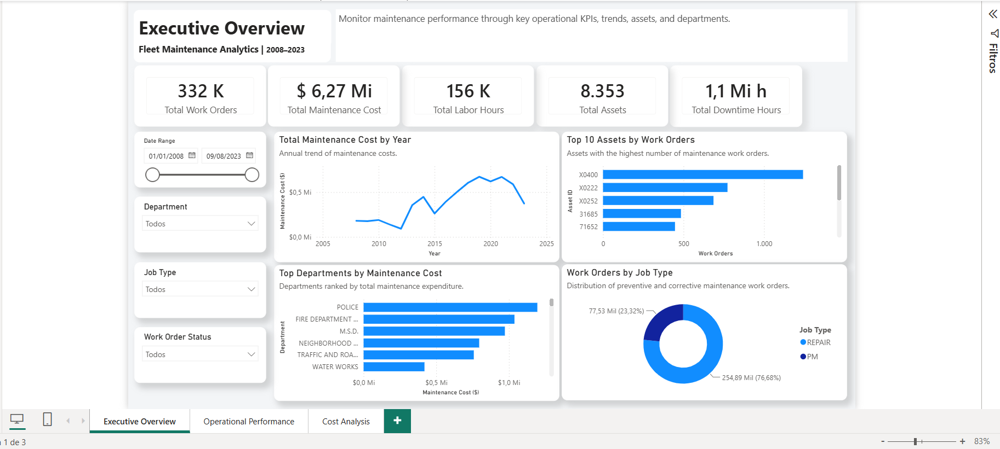
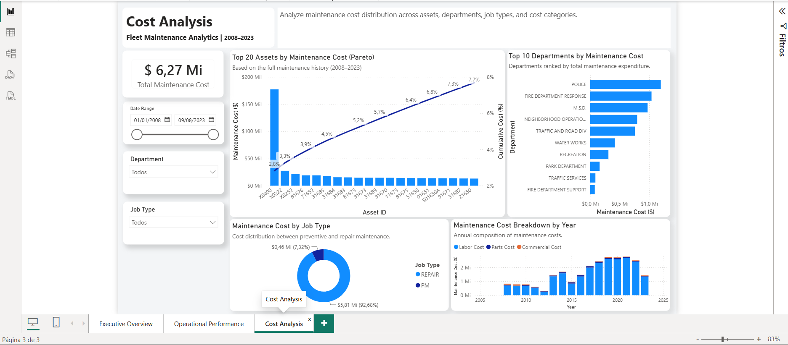
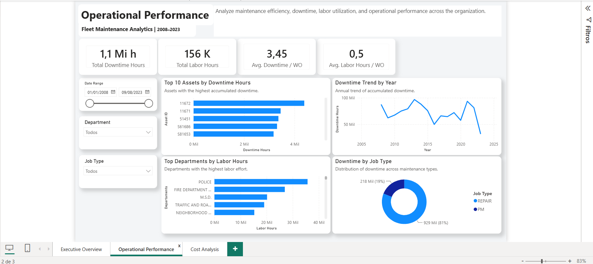

# Fleet Maintenance Analytics


End-to-end Business Intelligence solution for fleet maintenance analytics using **Python, SQLite, SQL and Power BI**.

This project demonstrates the complete analytics workflow, from ETL development and dimensional modeling to executive dashboards designed for maintenance decision-making.

---

## Dashboard Preview

### Executive Overview



### Cost Analysis



### Operational Performance



---

# Project Highlights

- End-to-end BI solution
- Python ETL pipeline
- SQLite analytical database
- Star Schema dimensional model
- Power BI executive dashboard
- Advanced DAX measures
- Pareto Analysis
- Interactive filters
- Context-aware tooltips
- Three-page business storytelling

---

# Business Problem

Maintenance managers often have access to large amounts of operational data but lack a consolidated analytical view that supports strategic decision-making.

This solution transforms raw maintenance records into an interactive dashboard capable of identifying:

- Maintenance cost concentration
- Operational efficiency
- Asset reliability
- Downtime behavior
- Department performance
- Preventive vs corrective maintenance distribution

---

# Solution Architecture

```
Raw Dataset
      │
      ▼
 Python ETL
      │
      ▼
 SQLite Database
      │
      ▼
 CSV Export
      │
      ▼
 Power BI
      │
      ▼
 Executive Dashboard
```

---

# Data Model

The analytical model follows a **Star Schema**.

### Fact Table

- Fact_Work_Orders

### Dimensions

- Dim_Date
- Dim_Asset
- Dim_Location
- Dim_Job_Type

This structure improves performance, simplifies DAX calculations and follows Microsoft Power BI best practices.

---

# Dashboard Pages

## 1. Executive Overview

High-level operational dashboard containing:

- Executive KPIs
- Annual maintenance cost trend
- Top assets by work orders
- Top departments by maintenance cost
- Work order distribution by maintenance type

---

## 2. Cost Analysis

Dedicated maintenance cost analysis.

Features include:

- Pareto Analysis
- Cost distribution by department
- Cost by maintenance type
- Annual maintenance cost composition
- Maintenance cost concentration

---

## 3. Operational Performance

Focused on operational efficiency.

Includes:

- Downtime KPIs
- Labor utilization
- Top downtime assets
- Downtime trend
- Labor distribution
- Maintenance workload

---

# Technologies

| Technology | Purpose |
|------------|---------|
| Python | ETL pipeline |
| Pandas | Data transformation |
| SQLite | Analytical database |
| SQL | Data modeling |
| Power BI | Dashboard development |
| DAX | Business calculations |
| GitHub | Version control |

---

# Repository Structure

```
fleet-maintenance-analytics
│
├── data
│   ├── raw
│   └── processed
│       └── powerbi
│
├── database
│
├── docs
│
├── images
│
├── powerbi
│
├── src
│
├── LICENSE
└── README.md
```

---

# Key Business Insights

The dashboard allows users to identify:

- Assets generating the highest maintenance costs
- Assets with the highest maintenance workload
- Departments responsible for the largest maintenance expenditures
- Downtime trends over time
- Labor utilization
- Cost concentration using Pareto Analysis
- Distribution of preventive and corrective maintenance

---

# Skills Demonstrated

### Data Engineering

- ETL Development
- Python
- SQL
- SQLite

### Business Intelligence

- Star Schema Modeling
- Power BI
- DAX
- KPI Design
- Dashboard Development

### Analytics

- Executive Reporting
- Pareto Analysis
- Data Storytelling
- Interactive Visualization

---

# Data Source

This project uses publicly available maintenance work order data provided by the City of Cincinnati Open Data Portal.

The dataset contains historical fleet maintenance records, including work orders, labor hours, downtime, maintenance costs, assets, departments and maintenance types.

Source:
[https://data.cincinnati-oh.gov/](https://data.cincinnati-oh.gov/Thriving-Neighborhoods/Fleet-Preventative-Maintenance-Repair-Work-Orders/2a8x-bxjm/about_data)

---

# Notes

The `fact_work_orders` dataset is compressed as a ZIP archive to reduce repository size while preserving reproducibility.

---

## Key Features

- Python ETL pipeline
- Star Schema dimensional model
- Interactive Power BI dashboard
- Advanced DAX calculations
- Pareto analysis
- Executive business storytelling

---

## Data Disclaimer

This project was developed exclusively for educational and portfolio purposes using publicly available data. All analyses, transformations and dashboard design were independently developed by the author.

---

# Author

**Jonas Soares Rodrigues**

- GitHub: https://github.com/jrodrigues250
- LinkedIn: www.linkedin.com/in/jonas-soares-rodrigues
